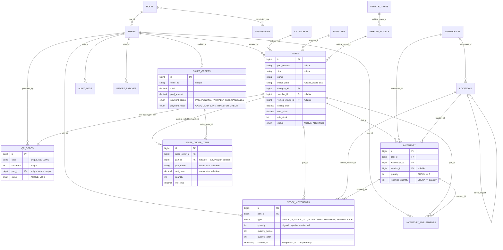

# Database Reference

MySQL 8. 14 migrations, chronological, no gaps (`backend/database/migrations/`). This
document is grouped by domain area; every column, constraint and FK below is read directly
from the migration files, not inferred.

## Entity-relationship diagram

## Auth & RBAC

| Table | Key columns | Constraints |
|---|---|---|
| `users` | `id`, `name`, `email`, `password`, `role_id`→`roles` (null on delete), `is_active`, `last_login_at` | `email` unique; soft-deletes; index `(is_active, role_id)` |
| `roles` | `id`, `slug`, `name`, `description` | `slug` unique — `ADMIN`, `MANAGER`, `WAREHOUSE_STAFF`, `VIEWER` |
| `permissions` | `id`, `slug`, `name`, `group` | `slug` unique |
| `permission_role` | `permission_id`, `role_id` | composite PK, both FK cascade-delete |

One role per user (`users.role_id`), many permissions per role via `permission_role`.
`EnsurePermission` middleware checks `user.role.permissions` on every protected request.

## Catalog

| Table | Key columns | Constraints |
|---|---|---|
| `categories` | `id`, `name`, `code` (3 letters — the `BRK` in a part-number scheme), `description`, `is_active` | `name`, `code` unique; soft-deletes |
| `suppliers` | `id`, `name`, `contact_person`, `phone`, `email`, `address`, `notes`, `is_active` | `name` unique; soft-deletes |
| `vehicle_makes` | `id`, `name`, `code` (3 letters) | `name`, `code` unique |
| `vehicle_models` | `id`, `vehicle_make_id`→`vehicle_makes` (cascade), `name` | unique `(vehicle_make_id, name)` |
| `parts` | `id`, `part_number`, `sku`, `name`, `description`, `image_path` (nullable, path on the `public` disk), `category_id`→`categories` (**restrict** delete), `supplier_id`→`suppliers` (null on delete), `vehicle_model_id`→`vehicle_models` (null on delete), `unit`, `selling_price` / `cost_price` decimal(12,2), `min_stock`, `status` enum(`ACTIVE`,`ARCHIVED`), `created_by`→`users` | `part_number`, `sku` unique; soft-deletes; indexes on `name`, `(status, category_id)` |

`category_id` is a **restrict**-on-delete FK — deliberately the one relationship that
refuses at the database level, not just the application level, if a category with parts
is deleted.

## Location hierarchy

| Table | Key columns | Constraints |
|---|---|---|
| `warehouses` | `id`, `name`, `code`, `address`, `is_active` | `code` unique |
| `locations` | `id`, `warehouse_id`→`warehouses` (cascade), `parent_id`→`locations` (self, nullable, cascade), `type` enum(`ZONE`,`RACK`,`SHELF`,`BIN`), `name`, `code`, `full_path` | unique `(warehouse_id, code)`; index `(warehouse_id, parent_id)`; index on `full_path` |

Warehouse → Zone → Rack → Shelf → Bin is one self-referencing adjacency-list table rather
than five hard-coded tables, so the hierarchy stays arbitrary-depth. `full_path` (e.g. `"WH1
/ Zone A / R3 / S2 / B7"`) is a denormalized cache for display and search only — `parent_id`
is the source of truth, and the app layer (`LocationRequest`) enforces that a `ZONE` has no
parent and every other type sits directly under the correct parent type.

## Inventory & QR

| Table | Key columns | Constraints |
|---|---|---|
| `qr_codes` | `id`, `code` (e.g. `SJL-00001`), `sequence`, `part_id`→`parts` (cascade), `status` enum(`ACTIVE`,`VOID`), `generated_by`→`users`, `generated_at`, `last_printed_at`, `print_count`, `scan_count`, `last_scanned_at` | `code` unique, `sequence` unique, `part_id` unique — **one identity per part type**, enforced by the database, not just the service layer |
| `inventory` | `id`, `part_id`→`parts` (cascade), `warehouse_id`→`warehouses` (**restrict**), `location_id`→`locations` (null on delete), `quantity`, `reserved_quantity` | unique `(part_id, warehouse_id, location_id)`; `CHECK (quantity >= 0)`; `CHECK (reserved_quantity <= quantity)`; index on `quantity` |

A part's on-hand total is `SUM(quantity)` across its `inventory` rows — stock is held per
part **and** location, so a transfer between bins is expressible as two row updates rather
than requiring a separate "total stock" column to stay in sync by hand. Both CHECK
constraints are added via raw `DB::statement` (MySQL 8 enforces `CHECK`), as a database-level
backstop behind the service-layer `lockForUpdate()` guard.

## Stock movements & adjustments

| Table | Key columns | Constraints |
|---|---|---|
| `stock_movements` | `id`, `part_id`→`parts` (cascade), `inventory_id`→`inventory` (null on delete), `warehouse_id`, `location_id`, `from_location_id`, `to_location_id` (all →locations, null on delete), `type` enum(`STOCK_IN`,`STOCK_OUT`,`ADJUSTMENT`,`TRANSFER`,`RETURN`,`SALE`), `quantity` (**signed** — negative = outbound), `quantity_before`, `quantity_after`, `reference_type`, `reference_id`, `reference_no`, `reason`, `user_id` | **no `updated_at`** — append-only, no update/delete route exists; indexes `(part_id, created_at)`, `(type, created_at)`, `(reference_type, reference_id)` |
| `inventory_adjustments` | `id`, `part_id`→`parts` (cascade), `inventory_id`→`inventory` (null on delete), `adjustment_type` enum(`STOCK_RECEIVED`,`MANUAL_ADJUSTMENT`,`SALE_CORRECTION`,`DAMAGE_WRITE_OFF`), `quantity_before`, `adjustment` (signed), `quantity_after`, `reason`, `note`, `user_id` | `created_at` only; index `(part_id, created_at)` |

`stock_movements` is the single ledger every stock-affecting action writes to — a sale, a
delivery, a transfer, and a manual correction all leave one row here, which is what lets the
dashboard, the movement feed, and the audit log agree on "what happened" without
cross-referencing separate tables. A mistake is corrected with a new compensating row, never
by editing history.

## Sales / orders (POS)

| Table | Key columns | Constraints |
|---|---|---|
| `sales_orders` | `id`, `order_no`, `customer_name` (default `"Walk-in customer"`), `customer_phone`, `subtotal`/`discount`/`total`/`paid_amount` decimal(12,2), `payment_status` enum(`PAID`,`PENDING`,`PARTIALLY_PAID`,`CANCELLED`), `payment_mode` enum(`CASH`,`CARD`,`BANK_TRANSFER`,`CREDIT`), `status` enum(`COMPLETED`,`CANCELLED`), `cashier_id`→`users` (null on delete), `ordered_at` | `order_no` unique; index `(ordered_at, payment_status)`, index `customer_name` |
| `sales_order_items` | `id`, `sales_order_id`→`sales_orders` (cascade), `part_id`→`parts` (**nullable**, null on delete), `qr_code`/`part_number`/`part_name`/`unit_price` (**snapshots**), `quantity`, `line_total` | index on `part_id` |

Line items snapshot the part's identity and price at the moment of sale rather than joining
live catalogue data — a bill printed today must read exactly as it did on the day of sale,
even after the part is later renamed, repriced, or deleted (`part_id` going `null` on
deletion is expected and harmless; the snapshot columns are what the bill actually renders).

## System

| Table | Key columns | Constraints |
|---|---|---|
| `import_batches` | `id`, `user_id`→`users` (null on delete), `filename`, `stored_path`, `total_rows`/`valid_rows`/`created_count`/`updated_count`/`duplicate_count`/`rejected_count`, `status` enum(`UPLOADED`,`VALIDATED`,`IMPORTED`,`FAILED`), `preview` json, `errors` json | index on `status` |
| `audit_logs` | `id`, `user_id`→`users` (null on delete), `action`, `entity_type`, `entity_id`, `description`, `old_values` json, `new_values` json, `ip_address`, `user_agent` | `created_at` only; indexes on `action`, `(entity_type, entity_id)`, `(user_id, created_at)` |
| `settings` | `id`, `key`, `value` json, `group` | `key` unique |

Plus Laravel/Sanctum framework tables (no domain relationships): `password_reset_tokens`,
`sessions`, `cache`, `jobs`, `personal_access_tokens`.

`audit_logs.old_values`/`new_values` never contain passwords, tokens, or other sensitive
attributes — those are stripped by `AuditLogger` before a row is written, not filtered on
the way out.
